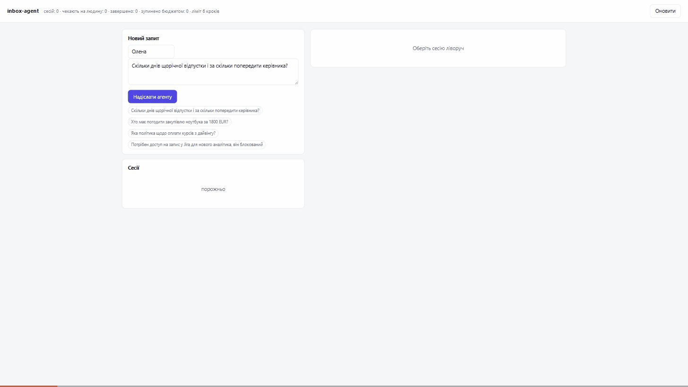

# inbox-agent

Агент-оркестратор вхідного потоку. На вході — запит від людини у вільній формі
(пошта, месенджер, вебхук), на виході — **виконана дія**: відповідь із
посиланням на регламент, створена задача, поставлена зустріч або чесно
передана людині справа.

Це продовження `ai-request-classifier`. Той класифікує — і далі все одно
робить людина. Цей **діє**, і головне питання проекту не «чи вміє модель
викликати функції», а: **що не дасть їй наробити дурниць.**



На записі — реальний прогін: запит про відпустку, агент шукає в регламенті,
складає відповідь **із посиланням на розділ** і зупиняється. У картці
підтвердження видно готовий текст листа, а не сирі аргументи виклику. Після
«Підтвердити» лист іде, а в трасі лишається повний ланцюжок разом із рішенням
людини. Бюджет унизу: 3 кроки з 6, 5526 токенів із 20 000, 14.1 с.

Три відповіді, кожна з них — окремий шар:

| Ризик | Запобіжник |
|---|---|
| агент зациклиться і з'їсть квоту | три незалежні бюджети: кроки, токени, час |
| агент зробить незворотну дію | пауза й підтвердження людини перед нею |
| агент вигадає факт про компанію | пошук по регламентах із порогом релевантності й ескалація, коли не знайдено |

---

## Що всередині

```
запит → [модель обирає інструмент] → [бюджет?] → [незворотна дія? → ЛЮДИНА]
      → [виконання] → [результат назад у модель] → … → підсумок
```

П'ять інструментів, нативний function calling Gemini, **без фреймворку**:
увесь агент — це один явний `while` у `src/agent.py`. Фреймворк ховає саме цей
цикл, а разом із ним і місця, куди треба ставити запобіжники.

| Інструмент | Що робить | Підтвердження |
|---|---|---|
| `search_knowledge_base` | шукає у внутрішніх регламентах, повертає фрагмент із посиланням на розділ | ні |
| `create_task` | створює внутрішню задачу в трекері | ні |
| `reply_with_template` | надсилає відповідь автору за шаблоном | **так** |
| `schedule_meeting` | ставить зустріч у календарі учасників | **так** |
| `escalate_to_human` | передає запит людині (термінальний) | ні |

### Чому підтвердження не на всьому

Спокуса позначити «потребує підтвердження» на кожній дії, що щось змінює, —
і саме так human-in-the-loop перетворюється на штамп. Коли підтвердження
просять двадцять разів на день, людина тисне «підтвердити» не читаючи, і
запобіжник перестає працювати рівно тоді, коли він потрібен.

Тому межа проведена не по «читає / пише», а по **зворотності й видимості**:
внутрішню задачу видаляють одним рухом, а лист, який пішов клієнтові, назад не
забереш. Помилитись у бік «зайве підтвердження» дешево лише на папері.

---

## Швидкий старт

```bash
python -m venv .venv
.venv/Scripts/pip install -r requirements.txt     # Linux/macOS: .venv/bin/pip

cp .env.example .env
# вписати у .env: GEMINI_API_KEY=<ключ з https://aistudio.google.com/apikey>

.venv/Scripts/python main.py serve                # веб-інтерфейс на :7860
.venv/Scripts/python main.py ask "Скільки днів відпустки?"
.venv/Scripts/python main.py eval --retrieval-only   # метрики пошуку, без мережі
```

Без ключа сервіс **усе одно піднімається**: черга підтверджень, траси й рішення
людини працюють, `POST /requests` віддає 503. Показувати порожню форму замість
роботи агента означало б робити демо, яке виглядає працюючим і не є ним.

### Команди

| Команда | Що робить |
|---|---|
| `ask <текст>` | один запит, траса в консоль; `--approve` одразу підтверджує |
| `inbox` | прогін демо-набору запитів зі `eval/scenarios.yaml` |
| `serve` | HTTP API + веб-інтерфейс на `PORT` (дефолт 7860) |
| `eval` | метрики пошуку і поведінки агента |
| `eval --retrieval-only` | тільки пошук — без мережі, без ключа, без витрат |

### Тести

```bash
.\scripts\run_tests_capped.ps1        # Windows: ліміт памʼяті тримає ядро
.venv/Scripts/python -m pytest -q     # звичайний прогін
```

Ключ не потрібен: модель підмінена **сценарним фейком**, який віддає наперед
задану послідовність ходів. Завдяки цьому перевіряється саме цикл — бюджети,
пауза, відновлення — а не поведінка живої моделі, яка щоразу інакша.

Про `run_tests_capped.ps1` окремо: ліміт памʼяті ставиться через
`docker run --memory`, тобто cgroups. Попередня версія робила те саме через
Windows Job Object і P/Invoke до `kernel32` — і Avast карантинував її як
`IDP.HELU.PSD11` (евристика «маніпуляція процесами», хибне спрацювання).
Сперечатися з антивірусом марно, а ліміт потрібен: незакритий цикл у тестах
одного разу зʼїв 27 ГБ. Перевірено, що стеля справді тримає: спроба виділити
3 ГБ під лімітом 512 МБ дає код виходу 137 — процес убиває ядро, хост цілий.

### Docker

```bash
docker build -t inbox-agent .
docker run --rm -p 7860:7860 --env-file .env inbox-agent
```

---

## Запобіжники: що саме зупиняє агента

### Три бюджети, і чому саме три

Вони ловлять різні збої, тому жоден не замінює інший:

* **`max_steps`** — модель ходить по колу різними формулюваннями;
* **`max_tokens`** — кроків небагато, але контекст росте і кожен дорожчає;
* **`timeout_s`** — обидва попередні мовчать, бо один виклик просто висить.

Плюс четвертий, який не є бюджетом: **детектор циклу**. Ліміту кроків
недостатньо — агент може вкластися в шість кроків і при цьому шість разів
запитати те саме. Однакові аргументи означають однаковий результат, тому
повтор виклику з тими самими аргументами зупиняє сесію.

Перевищення будь-якого ліміту — не виняток, а нормальний кінець сесії зі
статусом `aborted` і причиною в трасі. Мовчазне продовження було б інцидентом.

**Витрати живуть у сесії, а не в пам'яті процесу.** Інакше «ліміт на задачу»
перетворюється на «ліміт на спробу»: агент, який упав і перезапустився, обходив
би власний запобіжник.

### Пауза, а не блокування

Агент, який уперся в незворотну дію, **не чекає** на людину в пам'яті. Він
зберігає стан і виходить. Рішення приходить окремим викликом `resume()` —
можливо, наступного ранку і точно в іншому процесі.

Щоб це працювало, історія розмови з моделлю **не зберігається** окремо: вона
щоразу відновлюється зі збереженої траси. Сесія, що чекає на підтвердження, —
це рядок у SQLite, а не об'єкт у пам'яті сервісу.

**Відмова не завершує сесію.** Модель дізнається про неї тим самим каналом, що
й про будь-який результат інструмента, і обирає інший шлях — зазвичай
ескалацію. Обривати роботу на «ні» означало б лишити запит без відповіді
взагалі.

---

## Пошук по базі знань

`search_knowledge_base` реалізований **усередині проекту** — це не звернення до
сусіднього сервісу. Інструмент агента має відповідати за частки секунди й не
тягнути півтора гігабайта ваг: він викликається всередині циклу, під таймаутом
усієї задачі.

Тому лексичний пошук: структурне чанкування markdown (межа — заголовок, а не
N символів) + BM25 з українським стемером. Токенізація і стемер перенесені з
мого ж `kb-rag-assistant`, де ефект стемера заміряний.

---

## Метрики

Числа з [`output/eval-report.md`](output/eval-report.md), повні траси —
у [`output/traces.json`](output/traces.json). Відтворюються командою
`main.py eval`; частина про пошук — без мережі й без ключа.

### Головне: чи спрацював запобіжник

8 сценаріїв, `gemini-3.5-flash-lite`.

| Показник | Значення |
|---|---|
| Незворотних дій агент спробував зробити | 6 |
| З них зупинено й показано людині | 5 |
| Відсіяно перевіркою аргументів, людину не турбували | 1 |
| **Виконано без людини** | **0** |
| Сценаріїв пройдено повністю | **100%** (8 з 8) |
| Правильний перший інструмент | **100%** |
| У межах бюджету | 100% |
| Кроків на сценарій (сер. / макс. / ліміт) | 2.62 / 5 / 6 |
| Вартість 1000 запитів | **$1.16** |

Рядок «відсіяно перевіркою» — це сценарій, де агент спробував поставити
зустріч на 12:30. Регламент забороняє обідній час, перевірка аргументів
відмовила **до** паузи, агент побачив причину текстом і передав справу людині.
Тобто людину потурбували рівно 5 разів із 6 можливих, і жодного разу — даремно.

### Пошук по базі знань

25 питань із відповіддю в базі і 7 — без неї.

| Конфігурація | hit@1 | hit@3 | мовчить поза базою |
|---|---|---|---|
| без стемера, без порогу | 76.0% | 92.0% | 28.6% |
| без стемера | 72.0% | 84.0% | 100.0% |
| стемер, без порогу | 76.0% | **100.0%** | 28.6% |
| **стемер + поріг (робоча)** | **76.0%** | **92.0%** | **100.0%** |

Два висновки, які без таблиці були б просто словами:

**Стемер вартий свого місця.** З порогом він дає +8 п.п. hit@3 (92% проти 84%).
Українська флективна: «днів» і «дні» без нормалізації — різні токени.

**Поріг — це компроміс, і його треба міряти, а не вгадувати.**

| Поріг | hit@3 | мовчить поза базою |
|---|---|---|
| 0–1 | 100.0% | 28.6% |
| 2 | 100.0% | 71.4% |
| **3 (робочий)** | **92.0%** | **100.0%** |
| 4 | 84.0% | 100.0% |
| 5 | 72.0% | 100.0% |

Без порогу пошук знаходить усе — і на питання «хто президент Марса» теж
повертає розділ регламенту, бо слово «хто» є в половині документів. Агент
чесно вважав би це відповіддю. Перша спроба порогу була 4.0, заміряна на семи
питаннях; на повному наборі виявилося, що вона коштує 8 п.п. повноти задарма.

---

## Де рішення ламається / обмеження

- **Лексичний пошук не знає синонімів.** «Зламали акаунт» і «компрометація
  облікового запису» не мають жодного спільного токена. Закрито словником на
  десяток пар для найчастіших розбіжностей — це латка, а не розв'язання: слова,
  якого в словнику немає, так само не знайдеться. Embeddings закрили б клас
  цілком, але ціна — ваги моделі в циклі агента під таймаутом.
- **Поріг релевантності має тонкий запас.** Найвищий бал серед питань поза
  базою — 2.995 при порозі 3.0. На більшому корпусі поріг доведеться
  переміряти, а не успадкувати.
- **Один агент, один цикл, без пам'яті між запитами.** Кожен запит — окрема
  сесія. «Той самий звіт, що Оля просила в понеділок» цей агент не зв'яже:
  для цього потрібен пошук по історії запитів, а не по регламентах.
- **Побічні ефекти імітовані.** `create_task` пише в SQLite, а не в справжню
  Jira; `reply_with_template` зберігає лист, а не надсилає. Це свідомо: інтеграції
  з чужими API — окрема робота, а тут доводиться механіка агента. Місце для
  справжнього клієнта — рівно один обробник у `src/tools.py`.
- **Паралельні виклики інструментів ігноруються.** Модель іноді просить два
  одразу; беремо перший. Причина не в лінощах: паралельні виклики ламають і
  бюджет по кроках, і підтвердження — людина мала б погоджувати їх пачкою, не
  бачачи, який від чого залежить.
- **Gemini 3 і `thought_signature`.** Виклик функції треба повертати в історії
  разом із непрозорим підписом міркування, інакше **наступний** хід падає з
  400 INVALID_ARGUMENT. Перший хід при цьому проходить, тому баг виглядає як
  «агент ламається на другому кроці». Підпис тепер зберігається в трасі — і
  саме тому пауза на підтвердженні переживає перезапуск процесу.
- **Немає Telegram.** Планувався як інтерфейс підтвердження; зроблено веб, бо
  його видно в демо й він тестується без токена. Місце для адаптера — той самий
  `resume()`, який уже викликає HTTP-шар.
- **Сценаріїв у eval вісім.** Це перевірка поведінки на типових випадках, а не
  статистика. Достатньо, щоб побачити провал, замало, щоб порівнювати моделі.

---

## Що зробив би далі

1. **Довести побічні ефекти до справжніх систем** — Jira і календар. Обробники
   вже ізольовані, міняється лише тіло функції.
2. **Пам'ять між запитами**: пошук по попередніх сесіях того самого відправника,
   щоб агент бачив «це те саме, що просили вчора».
3. **Оцінка не тільки поведінки, а й тексту**: зараз перевіряється, який
   інструмент обрано; чи гарна відповідь у листі — не міряється.
4. **Телеметрія бюджетів у проді**: розподіл кроків і токенів на реальному
   потоці показав би, де стеля стоїть занадто високо.
5. **Telegram-адаптер** із кнопками підтвердження поверх наявного `resume()`.

---

## Структура

```
inbox-agent/
├── main.py                  # CLI: ask / inbox / serve / eval
├── src/
│   ├── agent.py             # цикл: бюджети, пауза, відновлення з траси
│   ├── tools.py             # п'ять інструментів + межа підтвердження
│   ├── llm.py               # нативний function calling, 4 рівні стійкості
│   ├── retrieval.py         # чанкування + BM25 + стемер + поріг
│   ├── store.py             # SQLite: сесії, черга, побічні ефекти
│   ├── schema.py            # сесія як стан, журнал і точка відновлення
│   ├── config.py            # бюджети
│   ├── evaluate.py          # метрики пошуку і поведінки
│   └── app.py               # FastAPI
├── web/index.html           # інтерфейс: траса, картка підтвердження
├── data/kb/                 # регламенти компанії (синтетичні)
├── eval/                    # сценарії агента + питання для пошуку
├── tests/                   # 48 тестів, жодного мережевого виклику
└── scripts/run_tests_capped.ps1
```
